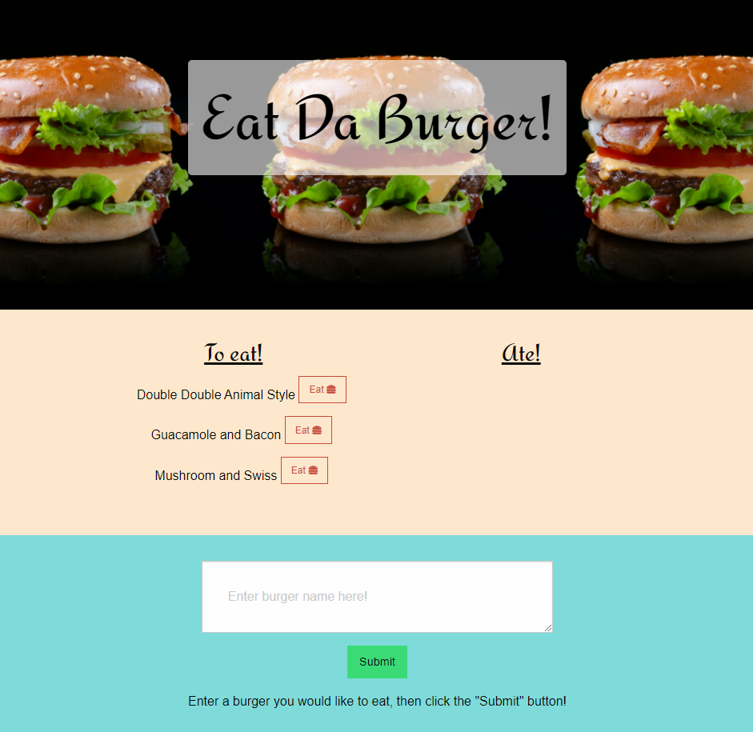
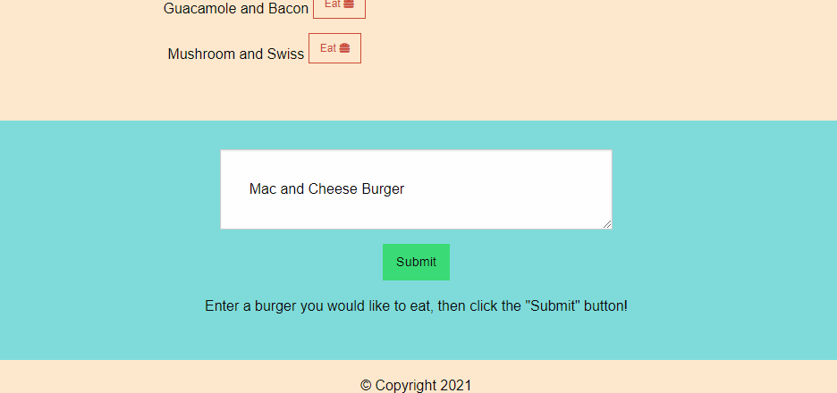
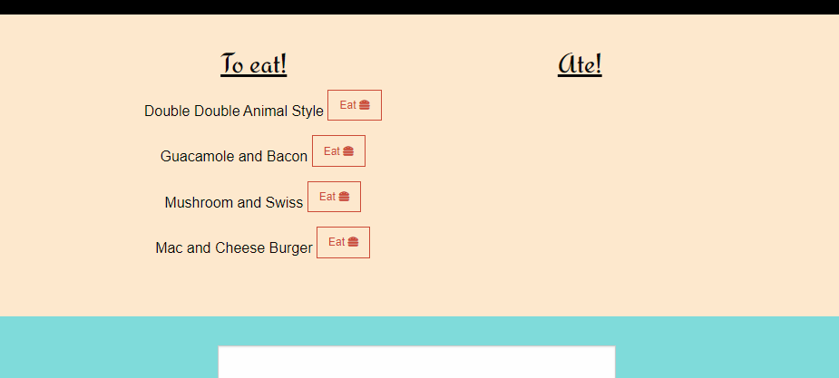
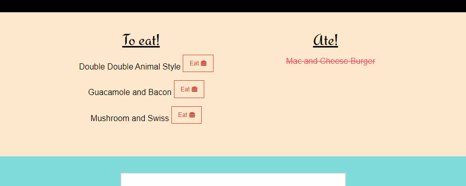

# Eat Da Burger 🍔

***

  
  
  
  

## Table of Contents
* [Description](#description)
* [Usage](#usage)
* [Questions](#questions)
* [License](#license)

 

## Description
Eat Da Burger is an app to keep track of burgers that should be eaten, as well as burgers that have been eaten.  A user may add burger names to a "To eat" list.  Once eaten, it will be switched over to an "Ate" list.

Feel free to check out the website [here]()
 

## Usage
Please see the following instructions on how to use this application:  
⭐ Once the webpage has been open, there will be a "To eat" list and an "Ate" list. 
⭐ To add to the "To eat" list, click on the textarea box below the lists and enter in a burger name. 

⭐ Once entered, click on the "Submit" button in order for the burger to appear in the list. 

⭐ To add the burger from the "To eat" list to the "Ate" list, click on the "Eat" button next to the burger name.  Once it has been clicked, the page will reload to reflect the changes. 

#### Notes on Usage
⭐ If you are cloning from this repo instead of using the app in Heroku, you will need to add your MySQL password in the config > connection.js file.

## Questions?
Feel free to check out my github profile [here](https://github.com/Christina2021)!
Should you have any questions, you may reach me by e-mail at: <a href="mailto:codechristina2021@gmail.com?subject=Hi,%20Christina!">codechristina2021@gmail.com</a>!.

## License
[MIT](https://choosealicense.com/licenses/mit/#)